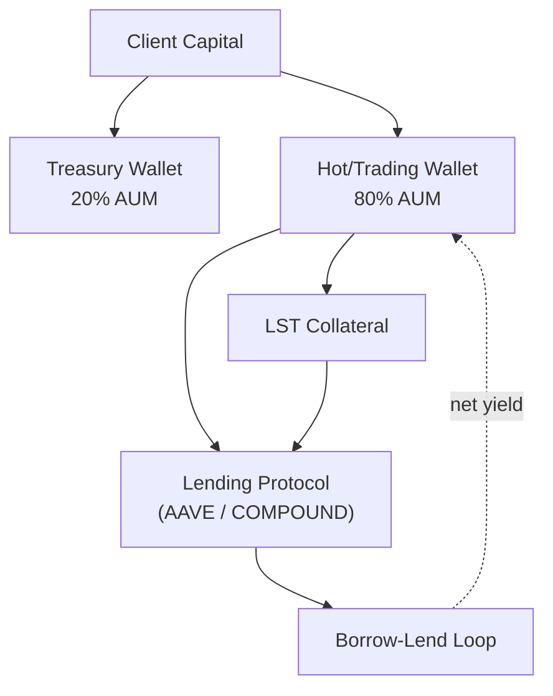

# Strategy Prospectus: Carry Recursive Borrow Lending Only

> **Archetype ID**: `CARRY_RECURSIVE_BORROW_LENDING_ONLY`  
> **Family**: `CARRY_AND_YIELD`  
> **Status** (codex): design  
> **Alpha disclosure**: full (debugging mode) — no client-facing curtailment applied.

## 1. What It Does + How It Makes Decisions

**[MACHINE-DERIVED]** Family: `CARRY_AND_YIELD` | Primary venue categories: DEFI

**[MACHINE-DERIVED]** Capability cells (from ARCHETYPE_CAPABILITY_REGISTRY):

| Venue Category | Instrument Type | Status    | Notes                                                                                                                    |
| -------------- | --------------- | --------- | ------------------------------------------------------------------------------------------------------------------------ |
| DEFI           | staking         | SUPPORTED | Family 1 pure-lending recursive arb: deposit stETH/jitSOL as collateral, borrow USDC, re-deposit into higher-yield lendi |

**[CODEX-DERIVED]** From `codex/09-strategy/architecture-v2/archetypes/`:

Pure-lending recursive supply-borrow loop on Aave V3 (with Spark / Morpho Blue / Compound V3 as future expansion). Holds
an LST collateral (e.g. wstETH), borrows ETH against it at the chain's highest available E-Mode LTV (0.93 on Aave
ETH_CORRELATED), swaps borrowed ETH -> wstETH on Uniswap V3, redeposits, and repeats up to `n_loops` times. Net yield =
stake yield x leverage_factor - ETH borrow rate x debt_factor. NO perp leg: closed-form math shows directional ETH
exposure is exactly `base` capital for any `(ltv, d)`, so the recursion amplifies the SPREAD, not the delta. Family 2
wraps the same legs with a USDC-margined perp short for delta neutrality; Family 1 accepts the directional exposure.

**[CODEX-DERIVED]** Execution semantics:

Per loop iteration (1...N): single ATOMIC bundle = (STAKE → TRANSFER → LEND → BORROW). Flash mode uses
`RecursiveLeverageReceiver.sol` to execute the full N-loop sequence inside one flash-loan callback. Unwind is the
symmetric inverse.

### LegController integration

`LegController.update(slot, tick, execution_mode=ATOMIC)` reads the `RecursiveLoopPlan` (n_loops, ltv_per_loop) from
`RecursiveLoopOrchestrator` (execution-service Python). Each loop fires as a bundled `AtomicInstruction`. Health-factor
gate (`LOOP_ABORTED_HF_LOW`) is checked inside `LegController.on_pre_leg_check()` before each iteration; abort triggers
`DEFI_HEALTH_FACTOR_CRITICAL` kill-switch.

**Code-backport status:** SHIPPED — `execution-service/defi_execution/orchestrators/recursive_loop_orchestrator.py`
already impleme
_...truncated (1018 chars total). See codex archetype doc for full detail._

## 2. Universe & Execution

**[CODEX-DERIVED]** Venue universe (from doc frontmatter): AAVE, COMPOUND, EULER, MORPHO, UNISWAP_V3

**[MACHINE-DERIVED]** Available execution algorithms: Adaptive Twap, Almgren Chriss, Hybrid Optimal, Passive Aggressive Hybrid, Pov Dynamic, Twap, Vwap

> **[MACHINE-DERIVED — GAP]** Order semantics (TIF/FOK/IOC/post-only, ref-pricing modes, multi-leg delta ownership): `not_registered` — VENUE_ORDER_SEMANTICS registry is honest-empty (Phase 2 backfill pending). See gap tracker: `plans/active/issues/capability_wizard_gap_discovery_2026_06_11.md`.

## 3. Exposures & Normalization

> **[MACHINE-DERIVED — FINDING F-CLASS: GAP]** No declared exposure-normalization model found for this archetype. Staked-vs-spot equivalence (e.g. stETH/ETH delta-adjusted exposure), base-currency-neutral views, and intra-leg netting rules are `not_registered` in any UAC registry. Gap tracker: `plans/active/issues/capability_wizard_gap_discovery_2026_06_11.md` — `AGENT P1: Exposure normalization location: staked-ETH vs ETH equivalence`.

## 4. Fund Flow

**[MACHINE-DERIVED]** Wallets and venues keyed by venue categories + TREASURY_SPLIT_POLICIES (DeFi 20/80, CeFi 0/100, Sports no-split). Staked-basis leg structure derived from archetype family + capability cells.

## 5. Risk & Circuit Breakers

**[MACHINE-DERIVED]** KillSwitchReason set (from UAC `enums.KillSwitchReason`):

- `COINTEGRATION_BREAKDOWN`
- `DAILY_LOSS_BREACH`
- `DATA_STALE`
- `DISABLED`
- `GREEK_LIMIT_BREACH`
- `KILL_SWITCH_TRIGGERED`
- `MAX_DRAWDOWN_BREACH`
- `VENUE_UNAVAILABLE`

**[MACHINE-DERIVED]** RiskGateLayer placement (from UAC `enums.RiskGateLayer`):

- `EXECUTION_PRETRADE`: Execution service pre-trade validation (order sizing, notional caps)
- `RISK_PREFLIGHT`: Risk service pre-flight validation (per-instruction, before execution queue)
- `STRATEGY_SELF_CHECK`: Strategy checks pre-instruction emit (position/PnL/delta guards)
- `VENUE_SIDE`: Venue-side limits (margin checks, open-order limits — external)

## 6. Performance

> **No backtest metrics recorded for this archetype configuration.** Run Phase 5 backtest-on-demand (`strategy_service/engine/backtest/runner.py` over historical data) to generate metrics.

**NEVER invented numbers are shown here** — this section is honest about the absence.

Metric set: `unified_trading_library.performance_metrics` defines the canonical metric surface (expected: Sharpe ratio, max drawdown, CAGR, Sortino, Calmar, win rate, avg trade PnL). Import was unavailable on this host.

## 7. Provenance

- `manifest_version`: 1.0.0
- `generated_from_commit`: `434e5beffedf400905475c64ca77535e474bd5fb`
- `archetype_id`: `CARRY_RECURSIVE_BORROW_LENDING_ONLY`
- `generated_by`: `scripts/openapi/generate_strategy_prospectus.py` (unified-trading-pm generator family)

_This prospectus is machine-generated. Sections marked [CODEX-DERIVED] are sourced from hand-authored engineering docs in `codex/09-strategy/architecture-v2/archetypes/`. Sections marked [MACHINE-DERIVED] are sourced from the capability manifest (UAC registry data, 409 nodes / 663 edges). Full alpha disclosure — debugging mode. Curtailment is a later config flag._
