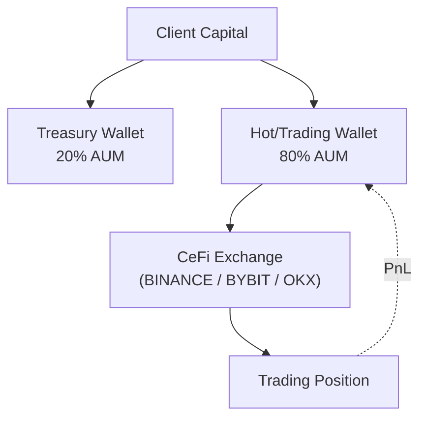

# Strategy Prospectus: Market Making Continuous

> **Archetype ID**: `MARKET_MAKING_CONTINUOUS`  
> **Family**: `MARKET_MAKING`  
> **Status** (codex): live  
> **Alpha disclosure**: full (debugging mode) — no client-facing curtailment applied.

## 1. What It Does + How It Makes Decisions

**[MACHINE-DERIVED]** Family: `MARKET_MAKING` | Primary venue categories: CEFI, DEFI, SPORTS, TRADFI

**[MACHINE-DERIVED]** Capability cells (from ARCHETYPE_CAPABILITY_REGISTRY):

| Venue Category | Instrument Type | Status    | Notes                                                                                 |
| -------------- | --------------- | --------- | ------------------------------------------------------------------------------------- |
| CEFI           | option          | PARTIAL   | Needs MultiLegOrderCapability (UAC gap #7).                                           |
| CEFI           | perp            | SUPPORTED |                                                                                       |
| CEFI           | spot            | SUPPORTED |                                                                                       |
| DEFI           | lp              | SUPPORTED | Active LP (Uniswap V3/V4, Orca, Raydium) + Passive LP (Curve, Balancer, Uniswap V2).  |
| DEFI           | option          | BLOCKED   | No supported DeFi options venue.                                                      |
| DEFI           | perp            | BLOCKED   | DeFi perp MM not exposed as third-party role.                                         |
| SPORTS         | event_settled   | PARTIAL   | Bankroll-as-collateral lay semantics need explicit execution_policy_ref (UAC gap #9). |
| TRADFI         | dated_future    | PARTIAL   | Formal MM designation out-of-scope for initial rollout.                               |
| TRADFI         | spot            | PARTIAL   | IBKR MM designation required; regulatory overhead.                                    |

**[CODEX-DERIVED]** From `codex/09-strategy/architecture-v2/archetypes/`:

Posts two-sided quotes around a theoretical fair price. Earns the bid-ask spread on fills. Covers CEX orderbook MM
(spot, perp, options) AND DeFi concentrated-liquidity LP on AMMs (Uniswap V3, V4, Orca, Aerodrome, etc.). Though the
venue mechanics differ (CLOB vs AMM), the alpha source is the same: providing liquidity and earning spread.

**[CODEX-DERIVED]** Execution semantics:

- **CLOB**: QUOTE action type; execution-service maintains quote lifecycle via delta-proxy repricer
- **LP**: ATOMIC multicalls for deposit/withdraw; TRADE for hedge leg on CEX

## 2. Universe & Execution

**[MACHINE-DERIVED]** Available execution algorithms: Adaptive Twap, Almgren Chriss, Hybrid Optimal, Passive Aggressive Hybrid, Pov Dynamic, Twap, Vwap

> **[MACHINE-DERIVED — GAP]** Order semantics (TIF/FOK/IOC/post-only, ref-pricing modes, multi-leg delta ownership): `not_registered` — VENUE_ORDER_SEMANTICS registry is honest-empty (Phase 2 backfill pending). See gap tracker: `plans/active/issues/capability_wizard_gap_discovery_2026_06_11.md`.

## 3. Exposures & Normalization

**[CODEX-DERIVED]** Risk profile:

**CLOB:**

- Drawdowns: modest + frequent (inventory on wrong side during adverse moves)
- Typical Sharpe: 2-5 in normal regimes
- Kill switches: price move > 5× ATR, inventory limit, venue outage

**LP:**

- Drawdowns: IL-driven; can be sharp during trending markets
- Typical Sharpe: 1.0-2.5 for concentrated LP with hedge; lower for passive
- Kill switches: IL > threshold, price out of range for > N hours, de-peg (stable pairs)

**[CODEX-DERIVED]** P&L attribution:

**CLOB:**

- Spread captured per fill
- Funding P&L (perp MM)
- Inventory P&L (directional P&L from carrying inventory)
- Fees
- Execution alpha (vs benchmark)

**LP:**

- Fees collected per swap event
- IL (impermanent loss) — realized on close or at each rebalance
- Hedge P&L (if hedging on CEX)
- Gas cost per rebalance (significant on Ethereum mainnet)

> **[MACHINE-DERIVED — FINDING F-CLASS: GAP]** No declared exposure-normalization model found for this archetype. Staked-vs-spot equivalence (e.g. stETH/ETH delta-adjusted exposure), base-currency-neutral views, and intra-leg netting rules are `not_registered` in any UAC registry. Gap tracker: `plans/active/issues/capability_wizard_gap_discovery_2026_06_11.md` — `AGENT P1: Exposure normalization location: staked-ETH vs ETH equivalence`.

## 4. Fund Flow

**[MACHINE-DERIVED]** Wallets and venues keyed by venue categories + TREASURY_SPLIT_POLICIES (DeFi 20/80, CeFi 0/100, Sports no-split). Staked-basis leg structure derived from archetype family + capability cells.

## 5. Risk & Circuit Breakers

**[MACHINE-DERIVED]** KillSwitchReason set (from UAC `enums.KillSwitchReason`):

- `COINTEGRATION_BREAKDOWN`
- `DAILY_LOSS_BREACH`
- `DATA_STALE`
- `DISABLED`
- `GREEK_LIMIT_BREACH`
- `KILL_SWITCH_TRIGGERED`
- `MAX_DRAWDOWN_BREACH`
- `VENUE_UNAVAILABLE`

**[MACHINE-DERIVED]** RiskGateLayer placement (from UAC `enums.RiskGateLayer`):

- `EXECUTION_PRETRADE`: Execution service pre-trade validation (order sizing, notional caps)
- `RISK_PREFLIGHT`: Risk service pre-flight validation (per-instruction, before execution queue)
- `STRATEGY_SELF_CHECK`: Strategy checks pre-instruction emit (position/PnL/delta guards)
- `VENUE_SIDE`: Venue-side limits (margin checks, open-order limits — external)

**[CODEX-DERIVED]** Archetype-specific risk notes:

**CLOB:**

- Drawdowns: modest + frequent (inventory on wrong side during adverse moves)
- Typical Sharpe: 2-5 in normal regimes
- Kill switches: price move > 5× ATR, inventory limit, venue outage

**LP:**

- Drawdowns: IL-driven; can be sharp during trending markets
- Typical Sharpe: 1.0-2.5 for concentrated LP with hedge; lower for passive
- Kill switches: IL > threshold, price out of range for > N hours, de-peg (stable pairs)

## 6. Performance

> **No backtest metrics recorded for this archetype configuration.** Run Phase 5 backtest-on-demand (`strategy_service/engine/backtest/runner.py` over historical data) to generate metrics.

**NEVER invented numbers are shown here** — this section is honest about the absence.

Metric set: `unified_trading_library.performance_metrics` defines the canonical metric surface (expected: Sharpe ratio, max drawdown, CAGR, Sortino, Calmar, win rate, avg trade PnL). Import was unavailable on this host.

## 7. Provenance

- `manifest_version`: 1.0.0
- `generated_from_commit`: `434e5beffedf400905475c64ca77535e474bd5fb`
- `archetype_id`: `MARKET_MAKING_CONTINUOUS`
- `generated_by`: `scripts/openapi/generate_strategy_prospectus.py` (unified-trading-pm generator family)

_This prospectus is machine-generated. Sections marked [CODEX-DERIVED] are sourced from hand-authored engineering docs in `codex/09-strategy/architecture-v2/archetypes/`. Sections marked [MACHINE-DERIVED] are sourced from the capability manifest (UAC registry data, 409 nodes / 663 edges). Full alpha disclosure — debugging mode. Curtailment is a later config flag._
