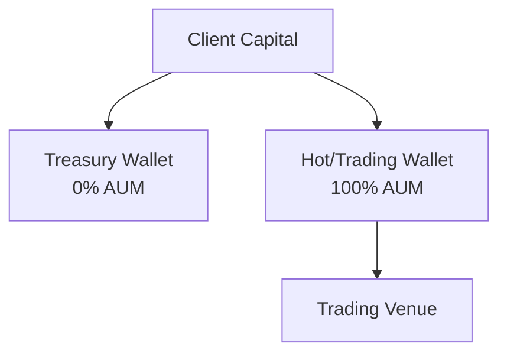

# Strategy Prospectus: Market Making Prediction

> **Archetype ID**: `MARKET_MAKING_PREDICTION`  
> **Family**: `MARKET_MAKING`  
> **Status** (codex): design  
> **Alpha disclosure**: full (debugging mode) — no client-facing curtailment applied.

## 1. What It Does + How It Makes Decisions

**[MACHINE-DERIVED]** Family: `MARKET_MAKING` | Primary venue categories: not registered

**[MACHINE-DERIVED]** Capability cells: `not_registered` — archetype not in ARCHETYPE_CAPABILITY_REGISTRY

**[CODEX-DERIVED]** From `codex/09-strategy/architecture-v2/archetypes/`:

Prediction market CLOB market making posts bid and ask quotes on YES/NO binary outcome contracts on Polymarket and
Kalshi. The strategy earns the bid-ask spread between matched fills while managing directional exposure from inventory
accumulation. Fair value for each contract is estimated from three sources: sharp-book calibration (implied probability
from liquid prediction exchanges), base-rate priors (historical frequency of similar events), and optionally a model
prediction. The goal is to price the binary outcome market fairly while collecting the spread, similar to
MARKET_MAKING_EVENT_SETTLED for sports markets but applied to political, economic, and other event-based contracts.

## 2. Universe & Execution

**[CODEX-DERIVED]** Venue universe (from doc frontmatter): KALSHI, POLYMARKET

**[MACHINE-DERIVED]** Available execution algorithms: Adaptive Twap, Almgren Chriss, Hybrid Optimal, Passive Aggressive Hybrid, Pov Dynamic, Twap, Vwap

> **[MACHINE-DERIVED — GAP]** Order semantics (TIF/FOK/IOC/post-only, ref-pricing modes, multi-leg delta ownership): `not_registered` — VENUE_ORDER_SEMANTICS registry is honest-empty (Phase 2 backfill pending). See gap tracker: `plans/active/issues/capability_wizard_gap_discovery_2026_06_11.md`.

## 3. Exposures & Normalization

> **[MACHINE-DERIVED — FINDING F-CLASS: GAP]** No declared exposure-normalization model found for this archetype. Staked-vs-spot equivalence (e.g. stETH/ETH delta-adjusted exposure), base-currency-neutral views, and intra-leg netting rules are `not_registered` in any UAC registry. Gap tracker: `plans/active/issues/capability_wizard_gap_discovery_2026_06_11.md` — `AGENT P1: Exposure normalization location: staked-ETH vs ETH equivalence`.

## 4. Fund Flow

**[MACHINE-DERIVED]** Wallets and venues keyed by venue categories + TREASURY_SPLIT_POLICIES (DeFi 20/80, CeFi 0/100, Sports no-split). Staked-basis leg structure derived from archetype family + capability cells.

## 5. Risk & Circuit Breakers

**[MACHINE-DERIVED]** KillSwitchReason set (from UAC `enums.KillSwitchReason`):

- `COINTEGRATION_BREAKDOWN`
- `DAILY_LOSS_BREACH`
- `DATA_STALE`
- `DISABLED`
- `GREEK_LIMIT_BREACH`
- `KILL_SWITCH_TRIGGERED`
- `MAX_DRAWDOWN_BREACH`
- `VENUE_UNAVAILABLE`

**[MACHINE-DERIVED]** RiskGateLayer placement (from UAC `enums.RiskGateLayer`):

- `EXECUTION_PRETRADE`: Execution service pre-trade validation (order sizing, notional caps)
- `RISK_PREFLIGHT`: Risk service pre-flight validation (per-instruction, before execution queue)
- `STRATEGY_SELF_CHECK`: Strategy checks pre-instruction emit (position/PnL/delta guards)
- `VENUE_SIDE`: Venue-side limits (margin checks, open-order limits — external)

## 6. Performance

> **No backtest metrics recorded for this archetype configuration.** Run Phase 5 backtest-on-demand (`strategy_service/engine/backtest/runner.py` over historical data) to generate metrics.

**NEVER invented numbers are shown here** — this section is honest about the absence.

Metric set: `unified_trading_library.performance_metrics` defines the canonical metric surface (expected: Sharpe ratio, max drawdown, CAGR, Sortino, Calmar, win rate, avg trade PnL). Import was unavailable on this host.

## 7. Provenance

- `manifest_version`: 1.0.0
- `generated_from_commit`: `434e5beffedf400905475c64ca77535e474bd5fb`
- `archetype_id`: `MARKET_MAKING_PREDICTION`
- `generated_by`: `scripts/openapi/generate_strategy_prospectus.py` (unified-trading-pm generator family)

_This prospectus is machine-generated. Sections marked [CODEX-DERIVED] are sourced from hand-authored engineering docs in `codex/09-strategy/architecture-v2/archetypes/`. Sections marked [MACHINE-DERIVED] are sourced from the capability manifest (UAC registry data, 409 nodes / 663 edges). Full alpha disclosure — debugging mode. Curtailment is a later config flag._
