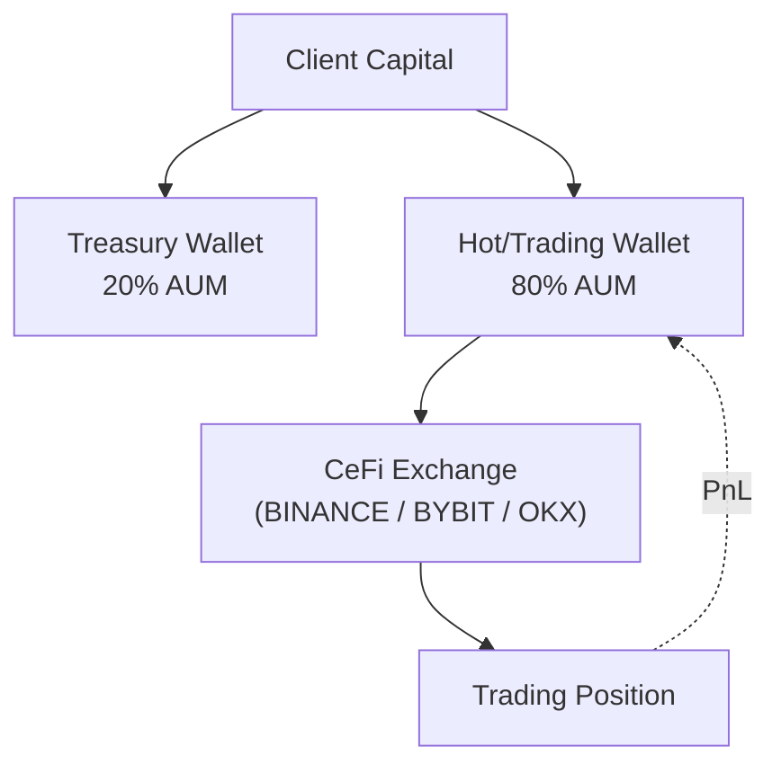

# Strategy Prospectus: Ml Directional Continuous

> **Archetype ID**: `ML_DIRECTIONAL_CONTINUOUS`  
> **Family**: `ML_DIRECTIONAL`  
> **Status** (codex): design  
> **Alpha disclosure**: full (debugging mode) — no client-facing curtailment applied.

## 1. What It Does + How It Makes Decisions

**[MACHINE-DERIVED]** Family: `ML_DIRECTIONAL` | Primary venue categories: CEFI, DEFI, TRADFI

**[MACHINE-DERIVED]** Capability cells (from ARCHETYPE_CAPABILITY_REGISTRY):

| Venue Category | Instrument Type | Status    | Notes                                                                                      |
| -------------- | --------------- | --------- | ------------------------------------------------------------------------------------------ |
| CEFI           | dated_future    | PARTIAL   | Settlement-aware reconciliation not batch-tested on Deribit dated.                         |
| CEFI           | option          | PARTIAL   | Expression axis supports atm_call / 25d_call / synthetic; multi-leg option router pending. |
| CEFI           | perp            | SUPPORTED |                                                                                            |
| CEFI           | spot            | SUPPORTED |                                                                                            |
| DEFI           | dated_future    | BLOCKED   | No DeFi dated-future venue.                                                                |
| DEFI           | option          | BLOCKED   | No supported DeFi options venue (Lyra / Dopex archived).                                   |
| DEFI           | perp            | SUPPORTED |                                                                                            |
| DEFI           | spot            | PARTIAL   | Pricing-fidelity flag missing (UAC gap #8) — thin pools not tick-stream-reliable.          |
| TRADFI         | dated_future    | PARTIAL   | Adapter batch-tested only for ES / NQ / CL; roll service required (BL-10).                 |
| TRADFI         | option          | PARTIAL   | CME options-on-futures not declared in UAC.                                                |
| TRADFI         | spot            | PARTIAL   | IBKR FIX adapter symbol universe declaration incomplete.                                   |

**[CODEX-DERIVED]** From `codex/09-strategy/architecture-v2/archetypes/`:

Consumes probability predictions from an ML model (per direction, per instrument, at some frequency), compares to
market-implied probability, and emits target-state trade instructions when edge + confidence thresholds are met.

**[CODEX-DERIVED]** Execution semantics:

- Instructions emitted as `TRADE` action with target_position_units
- Execution-service picks algo per execution_policy_ref rule table
- Default for NORMAL urgency: PASSIVE_AGGRESSIVE_HYBRID over the candle timeframe
- Fill stream back → engine updates current_position → next tick reconciles
- Benchmark fill in batch mode: fill at signal_price at signal_ts (zero exec alpha)

## 2. Universe & Execution

**[CODEX-DERIVED]** Venue universe (from doc frontmatter): BINANCE, BYBIT, CBOE, CME, DERIBIT, HYPERLIQUID, IBKR, OKX

**[MACHINE-DERIVED]** Available execution algorithms: Adaptive Twap, Almgren Chriss, Hybrid Optimal, Passive Aggressive Hybrid, Pov Dynamic, Twap, Vwap

> **[MACHINE-DERIVED — GAP]** Order semantics (TIF/FOK/IOC/post-only, ref-pricing modes, multi-leg delta ownership): `not_registered` — VENUE_ORDER_SEMANTICS registry is honest-empty (Phase 2 backfill pending). See gap tracker: `plans/active/issues/capability_wizard_gap_discovery_2026_06_11.md`.

## 3. Exposures & Normalization

**[CODEX-DERIVED]** Risk profile:

- Drawdown characteristic: 8-15% on crypto perps (moderate directional vol); lower on equities (3-8%)
- Typical Sharpe: 0.8-2.5 depending on model quality
- Kill switches: rapid price move (5× ATR), calibration breach (prediction error exceeds training residual), venue
  outage, daily-loss limit

> **[MACHINE-DERIVED — FINDING F-CLASS: GAP]** No declared exposure-normalization model found for this archetype. Staked-vs-spot equivalence (e.g. stETH/ETH delta-adjusted exposure), base-currency-neutral views, and intra-leg netting rules are `not_registered` in any UAC registry. Gap tracker: `plans/active/issues/capability_wizard_gap_discovery_2026_06_11.md` — `AGENT P1: Exposure normalization location: staked-ETH vs ETH equivalence`.

## Leg Structure

**[GAP — no leg structure]** This archetype has no entry in `ARCHETYPE_LEG_STRUCTURES` yet, so its structural per-leg restrictions (roles, per-leg instrument types, per-leg venue eligibility, conditional constraints) are not modelled — only the flat `(asset_group, instrument_type)` capability cells above apply. Tracked as a leg-truth gap (F22).

## 4. Fund Flow

**[MACHINE-DERIVED]** Wallets and venues keyed by venue categories + TREASURY_SPLIT_POLICIES (DeFi 20/80, CeFi 0/100, Sports no-split). Staked-basis leg structure derived from archetype family + capability cells.

## 5. Risk & Circuit Breakers

**[MACHINE-DERIVED]** KillSwitchReason set (from UAC `enums.KillSwitchReason`):

- `COINTEGRATION_BREAKDOWN`
- `DAILY_LOSS_BREACH`
- `DATA_STALE`
- `DISABLED`
- `GREEK_LIMIT_BREACH`
- `KILL_SWITCH_TRIGGERED`
- `MAX_DRAWDOWN_BREACH`
- `VENUE_UNAVAILABLE`

**[MACHINE-DERIVED]** RiskGateLayer placement (from UAC `enums.RiskGateLayer`):

- `EXECUTION_PRETRADE`: Execution service pre-trade validation (order sizing, notional caps)
- `RISK_PREFLIGHT`: Risk service pre-flight validation (per-instruction, before execution queue)
- `STRATEGY_SELF_CHECK`: Strategy checks pre-instruction emit (position/PnL/delta guards)
- `VENUE_SIDE`: Venue-side limits (margin checks, open-order limits — external)

**[CODEX-DERIVED]** Archetype-specific risk notes:

- Drawdown characteristic: 8-15% on crypto perps (moderate directional vol); lower on equities (3-8%)
- Typical Sharpe: 0.8-2.5 depending on model quality
- Kill switches: rapid price move (5× ATR), calibration breach (prediction error exceeds training residual), venue
  outage, daily-loss limit

## 6. Performance

> **No backtest metrics recorded for this archetype configuration.** Run Phase 5 backtest-on-demand (`strategy_service/engine/backtest/runner.py` over historical data) to generate metrics.

**NEVER invented numbers are shown here** — this section is honest about the absence.

When backtest results are available, the following metric set will be reported (from `unified_trading_library.performance_metrics`):

- `DAYS_PER_YEAR`

## 7. Provenance

- `manifest_version`: 1.0.0
- `generated_from_commit`: `c17a6be5b2bbbd7bb306468fcf10c90e6ed4007d`
- `archetype_id`: `ML_DIRECTIONAL_CONTINUOUS`
- `generated_by`: `scripts/openapi/generate_strategy_prospectus.py` (unified-trading-pm generator family)

_This prospectus is machine-generated. Sections marked [CODEX-DERIVED] are sourced from hand-authored engineering docs in `codex/09-strategy/architecture-v2/archetypes/`. Sections marked [MACHINE-DERIVED] are sourced from the capability manifest (UAC registry data, 409 nodes / 663 edges). Full alpha disclosure — debugging mode. Curtailment is a later config flag._
