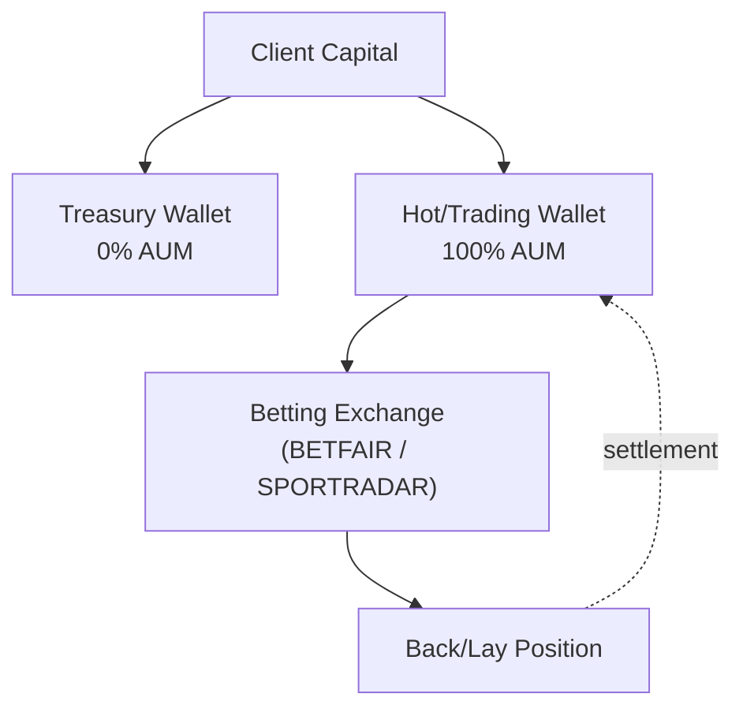

# Strategy Prospectus: Ml Directional Event Settled

> **Archetype ID**: `ML_DIRECTIONAL_EVENT_SETTLED`  
> **Family**: `ML_DIRECTIONAL`  
> **Status** (codex): design  
> **Alpha disclosure**: full (debugging mode) — no client-facing curtailment applied.

## 1. What It Does + How It Makes Decisions

**[MACHINE-DERIVED]** Family: `ML_DIRECTIONAL` | Primary venue categories: PREDICTION, SPORTS

**[MACHINE-DERIVED]** Capability cells (from ARCHETYPE_CAPABILITY_REGISTRY):

| Venue Category | Instrument Type | Status    | Notes                                                                                                                    |
| -------------- | --------------- | --------- | ------------------------------------------------------------------------------------------------------------------------ |
| PREDICTION     | event_settled   | SUPPORTED |                                                                                                                          |
| PREDICTION     | event_settled   | BLOCKED   | Kalshi execution adapter pending.                                                                                        |
| SPORTS         | event_settled   | SUPPORTED | Value-betting (edge_method=VALUE_PROB_VS_IMPLIED) is a config axis on this archetype, not a separate archetype. See code |

**[CODEX-DERIVED]** From `codex/09-strategy/architecture-v2/archetypes/`:

Consumes probability predictions from an ML model for each outcome of an event (sports 1X2, O/U, BTTS, 1H, halftime;
prediction-market binary), compares to market-implied probability, and places stakes on outcomes with sufficient edge +
confidence. Stakes settle at event resolution.

**[CODEX-DERIVED]** Execution semantics:

- `TRADE` instruction with target = bet (not position_units)
- Single-shot execution: submit, confirm placement, await settlement
- On Unity: API routes to specified child_book (or best-odds if unspecified); single wallet; no inter-book transfer
- On direct books: one wallet per book; strategy config declares eligible books

## 2. Universe & Execution

**[CODEX-DERIVED]** Venue universe (from doc frontmatter): BETDAQ, BETFAIR, MATCHBOOK, POLYMARKET, SMARKETS, UNITY

**[MACHINE-DERIVED]** Available execution algorithms: Adaptive Twap, Almgren Chriss, Hybrid Optimal, Passive Aggressive Hybrid, Pov Dynamic, Twap, Vwap

> **[MACHINE-DERIVED — GAP]** Order semantics (TIF/FOK/IOC/post-only, ref-pricing modes, multi-leg delta ownership): `not_registered` — VENUE_ORDER_SEMANTICS registry is honest-empty (Phase 2 backfill pending). See gap tracker: `plans/active/issues/capability_wizard_gap_discovery_2026_06_11.md`.

## 3. Exposures & Normalization

**[CODEX-DERIVED]** Risk profile:

- Drawdowns: 15-25% range for well-calibrated sports ML (high-variance outcomes)
- Typical Sharpe: 1.0-2.5 for top sports strategies
- Kill switches: daily-loss limit, per-event max stake breach, model calibration degradation (recent predictions failing
  against actuals), venue outage

**[CODEX-DERIVED]** P&L attribution:

- **Bet outcome**: win/loss/void on settlement
- **Commission**: subtract per-child-book commission on winning bets
- **Execution alpha**: difference between submitted odds and fill odds (exchange MM can give better prices; odds can
  drift before fill)
- **Timing alpha**: for odds-drift signal source, P&L attributable to CLV (closing line value) capture

> **[MACHINE-DERIVED — FINDING F-CLASS: GAP]** No declared exposure-normalization model found for this archetype. Staked-vs-spot equivalence (e.g. stETH/ETH delta-adjusted exposure), base-currency-neutral views, and intra-leg netting rules are `not_registered` in any UAC registry. Gap tracker: `plans/active/issues/capability_wizard_gap_discovery_2026_06_11.md` — `AGENT P1: Exposure normalization location: staked-ETH vs ETH equivalence`.

## Leg Structure

**[GAP — no leg structure]** This archetype has no entry in `ARCHETYPE_LEG_STRUCTURES` yet, so its structural per-leg restrictions (roles, per-leg instrument types, per-leg venue eligibility, conditional constraints) are not modelled — only the flat `(asset_group, instrument_type)` capability cells above apply. Tracked as a leg-truth gap (F22).

## 4. Fund Flow

**[MACHINE-DERIVED]** Wallets and venues keyed by venue categories + TREASURY_SPLIT_POLICIES (DeFi 20/80, CeFi 0/100, Sports no-split). Staked-basis leg structure derived from archetype family + capability cells.

## 5. Risk & Circuit Breakers

**[MACHINE-DERIVED]** KillSwitchReason set (from UAC `enums.KillSwitchReason`):

- `COINTEGRATION_BREAKDOWN`
- `DAILY_LOSS_BREACH`
- `DATA_STALE`
- `DISABLED`
- `GREEK_LIMIT_BREACH`
- `KILL_SWITCH_TRIGGERED`
- `MAX_DRAWDOWN_BREACH`
- `VENUE_UNAVAILABLE`

**[MACHINE-DERIVED]** RiskGateLayer placement (from UAC `enums.RiskGateLayer`):

- `EXECUTION_PRETRADE`: Execution service pre-trade validation (order sizing, notional caps)
- `RISK_PREFLIGHT`: Risk service pre-flight validation (per-instruction, before execution queue)
- `STRATEGY_SELF_CHECK`: Strategy checks pre-instruction emit (position/PnL/delta guards)
- `VENUE_SIDE`: Venue-side limits (margin checks, open-order limits — external)

**[CODEX-DERIVED]** Archetype-specific risk notes:

- Drawdowns: 15-25% range for well-calibrated sports ML (high-variance outcomes)
- Typical Sharpe: 1.0-2.5 for top sports strategies
- Kill switches: daily-loss limit, per-event max stake breach, model calibration degradation (recent predictions failing
  against actuals), venue outage

## 6. Performance

> **No backtest metrics recorded for this archetype configuration.** Run Phase 5 backtest-on-demand (`strategy_service/engine/backtest/runner.py` over historical data) to generate metrics.

**NEVER invented numbers are shown here** — this section is honest about the absence.

When backtest results are available, the following metric set will be reported (from `unified_trading_library.performance_metrics`):

- `DAYS_PER_YEAR`

## 7. Provenance

- `manifest_version`: 1.0.0
- `generated_from_commit`: `c17a6be5b2bbbd7bb306468fcf10c90e6ed4007d`
- `archetype_id`: `ML_DIRECTIONAL_EVENT_SETTLED`
- `generated_by`: `scripts/openapi/generate_strategy_prospectus.py` (unified-trading-pm generator family)

_This prospectus is machine-generated. Sections marked [CODEX-DERIVED] are sourced from hand-authored engineering docs in `codex/09-strategy/architecture-v2/archetypes/`. Sections marked [MACHINE-DERIVED] are sourced from the capability manifest (UAC registry data, 409 nodes / 663 edges). Full alpha disclosure — debugging mode. Curtailment is a later config flag._
