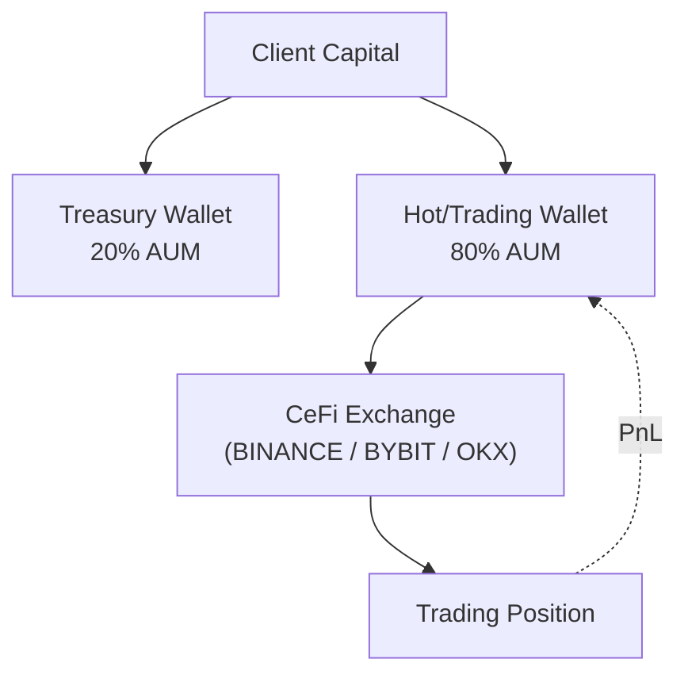

# Strategy Prospectus: Rules Directional Continuous

> **Archetype ID**: `RULES_DIRECTIONAL_CONTINUOUS`  
> **Family**: `RULES_DIRECTIONAL`  
> **Status** (codex): design  
> **Alpha disclosure**: full (debugging mode) — no client-facing curtailment applied.

## 1. What It Does + How It Makes Decisions

**[MACHINE-DERIVED]** Family: `RULES_DIRECTIONAL` | Primary venue categories: CEFI, DEFI, TRADFI

**[MACHINE-DERIVED]** Capability cells (from ARCHETYPE_CAPABILITY_REGISTRY):

| Venue Category | Instrument Type | Status    | Notes                                                                                                  |
| -------------- | --------------- | --------- | ------------------------------------------------------------------------------------------------------ |
| CEFI           | dated_future    | PARTIAL   | Settlement-aware rule harness not batch-tested.                                                        |
| CEFI           | option          | BLOCKED   | Directional options via rules is non-standard; use VOL_TRADING_OPTIONS or ML with expression=atm_call. |
| CEFI           | perp            | SUPPORTED |                                                                                                        |
| CEFI           | spot            | SUPPORTED |                                                                                                        |
| DEFI           | perp            | PARTIAL   | No codex instance examples yet.                                                                        |
| DEFI           | spot            | PARTIAL   | Same pricing-fidelity concern as ML DeFi spot.                                                         |
| TRADFI         | dated_future    | PARTIAL   | Adapter coverage partial; roll service required (BL-10).                                               |
| TRADFI         | option          | BLOCKED   | Same BL-4 — directional options via rules is non-standard.                                             |
| TRADFI         | spot            | PARTIAL   | IBKR FIX adapter declaration gap.                                                                      |

**[CODEX-DERIVED]** From `codex/09-strategy/architecture-v2/archetypes/`:

Evaluates a registry of explicit if-else rules on features. When a rule fires (feature conditions met), emit a
directional signal. Stake size is rule-specific (fixed % equity per rule or calibrated from backtested hit rate).

**[CODEX-DERIVED]** Execution semantics:

- Rule fires → emit TRADE with target_position_units
- Rule flips → emit TRADE with target_position_units = 0 (or opposite direction)
- Time-box expiry → emit TRADE with target_position_units = 0

## 2. Universe & Execution

**[CODEX-DERIVED]** Venue universe (from doc frontmatter): BINANCE, BYBIT, CBOE, CME, HYPERLIQUID, IBKR, OKX

**[MACHINE-DERIVED]** Available execution algorithms: Adaptive Twap, Almgren Chriss, Hybrid Optimal, Passive Aggressive Hybrid, Pov Dynamic, Twap, Vwap

> **[MACHINE-DERIVED — GAP]** Order semantics (TIF/FOK/IOC/post-only, ref-pricing modes, multi-leg delta ownership): `not_registered` — VENUE_ORDER_SEMANTICS registry is honest-empty (Phase 2 backfill pending). See gap tracker: `plans/active/issues/capability_wizard_gap_discovery_2026_06_11.md`.

## 3. Exposures & Normalization

**[CODEX-DERIVED]** Risk profile:

- Drawdowns: 5-15% depending on asset class
- Typical Sharpe: 0.5-1.5 (lower than best ML, but more stable)
- Kill switches: daily-loss limit, rule hit-rate collapse (rule's rolling hit rate < threshold → auto-retire)

**[CODEX-DERIVED]** P&L attribution:

- Per rule: track which rule fired for each position; attribute P&L to rule_id
- Per strategy instance: aggregate across rules
- Execution alpha vs benchmark: per-fill

> **[MACHINE-DERIVED — FINDING F-CLASS: GAP]** No declared exposure-normalization model found for this archetype. Staked-vs-spot equivalence (e.g. stETH/ETH delta-adjusted exposure), base-currency-neutral views, and intra-leg netting rules are `not_registered` in any UAC registry. Gap tracker: `plans/active/issues/capability_wizard_gap_discovery_2026_06_11.md` — `AGENT P1: Exposure normalization location: staked-ETH vs ETH equivalence`.

## 4. Fund Flow

**[MACHINE-DERIVED]** Wallets and venues keyed by venue categories + TREASURY_SPLIT_POLICIES (DeFi 20/80, CeFi 0/100, Sports no-split). Staked-basis leg structure derived from archetype family + capability cells.

## 5. Risk & Circuit Breakers

**[MACHINE-DERIVED]** KillSwitchReason set (from UAC `enums.KillSwitchReason`):

- `COINTEGRATION_BREAKDOWN`
- `DAILY_LOSS_BREACH`
- `DATA_STALE`
- `DISABLED`
- `GREEK_LIMIT_BREACH`
- `KILL_SWITCH_TRIGGERED`
- `MAX_DRAWDOWN_BREACH`
- `VENUE_UNAVAILABLE`

**[MACHINE-DERIVED]** RiskGateLayer placement (from UAC `enums.RiskGateLayer`):

- `EXECUTION_PRETRADE`: Execution service pre-trade validation (order sizing, notional caps)
- `RISK_PREFLIGHT`: Risk service pre-flight validation (per-instruction, before execution queue)
- `STRATEGY_SELF_CHECK`: Strategy checks pre-instruction emit (position/PnL/delta guards)
- `VENUE_SIDE`: Venue-side limits (margin checks, open-order limits — external)

**[CODEX-DERIVED]** Archetype-specific risk notes:

- Drawdowns: 5-15% depending on asset class
- Typical Sharpe: 0.5-1.5 (lower than best ML, but more stable)
- Kill switches: daily-loss limit, rule hit-rate collapse (rule's rolling hit rate < threshold → auto-retire)

## 6. Performance

> **No backtest metrics recorded for this archetype configuration.** Run Phase 5 backtest-on-demand (`strategy_service/engine/backtest/runner.py` over historical data) to generate metrics.

**NEVER invented numbers are shown here** — this section is honest about the absence.

Metric set: `unified_trading_library.performance_metrics` defines the canonical metric surface (expected: Sharpe ratio, max drawdown, CAGR, Sortino, Calmar, win rate, avg trade PnL). Import was unavailable on this host.

## 7. Provenance

- `manifest_version`: 1.0.0
- `generated_from_commit`: `434e5beffedf400905475c64ca77535e474bd5fb`
- `archetype_id`: `RULES_DIRECTIONAL_CONTINUOUS`
- `generated_by`: `scripts/openapi/generate_strategy_prospectus.py` (unified-trading-pm generator family)

_This prospectus is machine-generated. Sections marked [CODEX-DERIVED] are sourced from hand-authored engineering docs in `codex/09-strategy/architecture-v2/archetypes/`. Sections marked [MACHINE-DERIVED] are sourced from the capability manifest (UAC registry data, 409 nodes / 663 edges). Full alpha disclosure — debugging mode. Curtailment is a later config flag._
