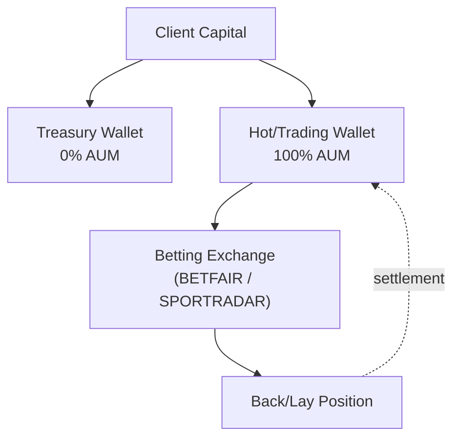

# Strategy Prospectus: Rules Directional Event Settled

> **Archetype ID**: `RULES_DIRECTIONAL_EVENT_SETTLED`  
> **Family**: `RULES_DIRECTIONAL`  
> **Status** (codex): design  
> **Alpha disclosure**: full (debugging mode) — no client-facing curtailment applied.

## 1. What It Does + How It Makes Decisions

**[MACHINE-DERIVED]** Family: `RULES_DIRECTIONAL` | Primary venue categories: PREDICTION, SPORTS

**[MACHINE-DERIVED]** Capability cells (from ARCHETYPE_CAPABILITY_REGISTRY):

| Venue Category | Instrument Type | Status  | Notes                                                     |
| -------------- | --------------- | ------- | --------------------------------------------------------- |
| PREDICTION     | event_settled   | PARTIAL | Docs + example instances gap.                             |
| SPORTS         | event_settled   | PARTIAL | Engine code complete; docs + example instances minor gap. |

**[CODEX-DERIVED]** From `codex/09-strategy/architecture-v2/archetypes/`:

Evaluates explicit rules on sports / prediction features to fire bets on specific markets when conditions are met. Rules
encode behavioural / statistical patterns known to produce edges in sports betting (e.g., "when home team scores first
within 20 min, back away team in HT draw").

**[CODEX-DERIVED]** Execution semantics:

- TRADE instruction per fired rule → stake on best-odds venue
- Instruction is one-shot (place bet, wait for settlement)
- Unity or direct book adapter handles placement

## 2. Universe & Execution

**[CODEX-DERIVED]** Venue universe (from doc frontmatter): BETFAIR, MATCHBOOK, POLYMARKET, SMARKETS, UNITY

**[MACHINE-DERIVED]** Available execution algorithms: Adaptive Twap, Almgren Chriss, Hybrid Optimal, Passive Aggressive Hybrid, Pov Dynamic, Twap, Vwap

> **[MACHINE-DERIVED — GAP]** Order semantics (TIF/FOK/IOC/post-only, ref-pricing modes, multi-leg delta ownership): `not_registered` — VENUE_ORDER_SEMANTICS registry is honest-empty (Phase 2 backfill pending). See gap tracker: `plans/active/issues/capability_wizard_gap_discovery_2026_06_11.md`.

## 3. Exposures & Normalization

**[CODEX-DERIVED]** Risk profile:

- Drawdowns: 10-20% typical for rule-based sports strategies
- Typical Sharpe: 0.5-1.5 (rules are often lower-edge than ML but more interpretable)
- Kill switches: daily loss limit, per-rule hit rate degradation (rolling window), rule retirement

**[CODEX-DERIVED]** P&L attribution:

- Per rule_id: track bets and P&L per rule → rule hit-rate + rule P&L time series
- Per strategy instance: aggregate across rules

> **[MACHINE-DERIVED — FINDING F-CLASS: GAP]** No declared exposure-normalization model found for this archetype. Staked-vs-spot equivalence (e.g. stETH/ETH delta-adjusted exposure), base-currency-neutral views, and intra-leg netting rules are `not_registered` in any UAC registry. Gap tracker: `plans/active/issues/capability_wizard_gap_discovery_2026_06_11.md` — `AGENT P1: Exposure normalization location: staked-ETH vs ETH equivalence`.

## Leg Structure

**[GAP — no leg structure]** This archetype has no entry in `ARCHETYPE_LEG_STRUCTURES` yet, so its structural per-leg restrictions (roles, per-leg instrument types, per-leg venue eligibility, conditional constraints) are not modelled — only the flat `(asset_group, instrument_type)` capability cells above apply. Tracked as a leg-truth gap (F22).

## 4. Fund Flow

**[MACHINE-DERIVED]** Wallets and venues keyed by venue categories + TREASURY_SPLIT_POLICIES (DeFi 20/80, CeFi 0/100, Sports no-split). Staked-basis leg structure derived from archetype family + capability cells.

## 5. Risk & Circuit Breakers

**[MACHINE-DERIVED]** KillSwitchReason set (from UAC `enums.KillSwitchReason`):

- `COINTEGRATION_BREAKDOWN`
- `DAILY_LOSS_BREACH`
- `DATA_STALE`
- `DISABLED`
- `GREEK_LIMIT_BREACH`
- `KILL_SWITCH_TRIGGERED`
- `MAX_DRAWDOWN_BREACH`
- `VENUE_UNAVAILABLE`

**[MACHINE-DERIVED]** RiskGateLayer placement (from UAC `enums.RiskGateLayer`):

- `EXECUTION_PRETRADE`: Execution service pre-trade validation (order sizing, notional caps)
- `RISK_PREFLIGHT`: Risk service pre-flight validation (per-instruction, before execution queue)
- `STRATEGY_SELF_CHECK`: Strategy checks pre-instruction emit (position/PnL/delta guards)
- `VENUE_SIDE`: Venue-side limits (margin checks, open-order limits — external)

**[CODEX-DERIVED]** Archetype-specific risk notes:

- Drawdowns: 10-20% typical for rule-based sports strategies
- Typical Sharpe: 0.5-1.5 (rules are often lower-edge than ML but more interpretable)
- Kill switches: daily loss limit, per-rule hit rate degradation (rolling window), rule retirement

## 6. Performance

> **No backtest metrics recorded for this archetype configuration.** Run Phase 5 backtest-on-demand (`strategy_service/engine/backtest/runner.py` over historical data) to generate metrics.

**NEVER invented numbers are shown here** — this section is honest about the absence.

When backtest results are available, the following metric set will be reported (from `unified_trading_library.performance_metrics`):

- `DAYS_PER_YEAR`

## 7. Provenance

- `manifest_version`: 1.0.0
- `generated_from_commit`: `c17a6be5b2bbbd7bb306468fcf10c90e6ed4007d`
- `archetype_id`: `RULES_DIRECTIONAL_EVENT_SETTLED`
- `generated_by`: `scripts/openapi/generate_strategy_prospectus.py` (unified-trading-pm generator family)

_This prospectus is machine-generated. Sections marked [CODEX-DERIVED] are sourced from hand-authored engineering docs in `codex/09-strategy/architecture-v2/archetypes/`. Sections marked [MACHINE-DERIVED] are sourced from the capability manifest (UAC registry data, 409 nodes / 663 edges). Full alpha disclosure — debugging mode. Curtailment is a later config flag._
